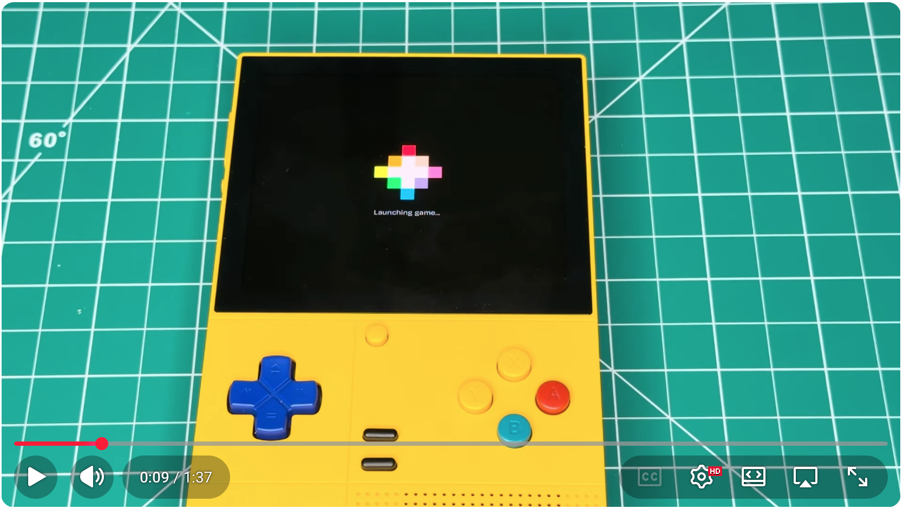

# GameNative: Cart Edition

GameNative allows you to play Windows games on Android devices. This fork has tweaks and optimizations for streamlining the user experience with **PICO-8** on your favorite Android retro handheld. It should also work with other custom games. Check the [PICO-8 guide](pico8.md).

[](https://youtu.be/Em4lBr4ipWs)

Changes in **Cart Edition**:
* Always offline mode. You don't need Steam credentials; this greatly improves game launch time.
* No tips on the game launch screen. Reading the same tips over and over becomes annoying very quickly.
* A single press of the back button exits the app and returns you to the Android home screen. You can switch between games very easily.
* The launch screen is black and shows an icon for the launching app.
* The app splash screen is black.
* No auto-update checks.
* New `-e exec_args {any}` command-line parameter (self-explanatory).
* New `-e cart {cart_file_path_png}` command-line parameter to run PICO-8 games.


Known issues:
* Sometimes it shows the Steam logon screen. If this happens, clear the app from recents or restart your device and try again.
* If you update the app, custom games may stop working. If this happens, delete the game container and create a new one.
* This fork has the same app ID as the original GameNative, so you cannot have both installed at the same time.

Thanks to the GameNative team for their work. Check out [the original project](https://github.com/utkarshdalal/GameNative) and their [Discord server](https://discord.gg/2hKv4VfZfE).

**Disclaimers**

* This project is not affiliated with the GameNative team or PICO-8 (Lexaloffle).
* PICO‑8 is proprietary software; you must own a valid license to use PICO‑8. This repository does not include PICO‑8 binaries, manuals, or copyrighted games.
* All in-app links redirect to original GameNative resources (including donation links).
* The app may download files from GameNative servers; please review GameNative's privacy policy.
* Use this software only with games and files you legally own. Do not use it for piracy or illegal purposes.
* This software is provided "AS IS". The maintainer is not liable for any damages, costs, or losses that may occur from using this software.

**Technical details**

_am start_ example:

```
am start -n app.gamenative/app.gamenative.MainActivity -a app.gamenative.LAUNCH_GAME -e cart {cart_file_path_png}
```
```
am start -n app.gamenative/app.gamenative.MainActivity -a app.gamenative.LAUNCH_GAME -ei app_id {number} -e exec_args {any_text}
```

Clone the repo with its submodules. Build this project in Android Studio using the DEBUG or RELEASE configuration. No additional files are needed.
